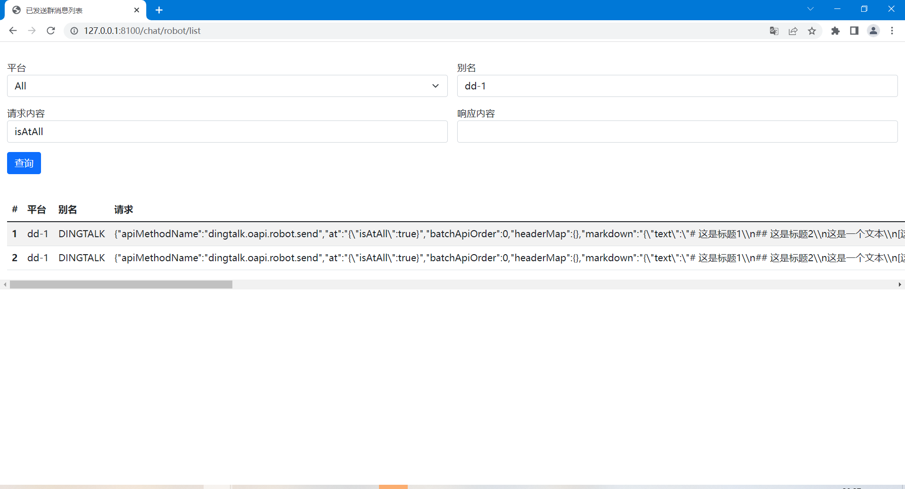

# message-spring-boot-starter

[](https://jitpack.io/#com.gitee.wb04307201/message-spring-boot-starter)

> 这是一个消息中间件  
> 通过配置和编码，即可将相同的消息通过钉钉自定义机器人、钉钉消息、飞书自定义机器人、飞书消息、企业微信自定义机器人、企业微信消息以及邮箱消息通道进行发送
> 提供统一消息维护方式，发送时会按照对应的平台类型自动进行转换

## [代码示例](https://gitee.com/wb04307201/message-demo)

## 第一步 增加 JitPack 仓库

```xml

<repositories>
    <repository>
        <id>jitpack.io</id>
        <url>https://jitpack.io</url>
    </repository>
</repositories>
```

## 第二步 引入jar

```xml

<dependency>
    <groupId>com.gitee.wb04307201</groupId>
    <artifactId>message-spring-boot-starter</artifactId>
    <version>开发中</version>
</dependency>
```

## 第三步 在启动类上加上`@EnableMessage`注解

```java

@EnableMessage
@SpringBootApplication
public class MessageDemoApplication {
    public static void main(String[] args) {
        SpringApplication.run(SpringTestApplication.class, args);
    }
}
```

## 第四步 `application.yml`配置文件中添加以下相关配置，可以配置多个群

#### 1. 配置钉钉自定义机器人

> 钉钉自定义机器人的配置请参考
> [自定义机器人接入](https://open.dingtalk.com/document/orgapp/custom-robot-access)
> [自定义机器人安全设置](https://open.dingtalk.com/document/orgapp/customize-robot-security-settings)
> 获得access_token和secret

```yaml
message:
  dingtalk:
    customRobot:
      - alias: alias #所有通道的别名不能重复
        accessToken: accessToken
        secret: secret
```

#### 2. 配置钉钉消息

> 钉钉消息需要先注册企业内部应用，应用的配置请参考
> [基础概念](https://open.dingtalk.com/document/isvapp/basic-concepts)
> 获得appkey、appsecret、agentId

```yaml
message:
  dingtalk:
    message:
      - alias: alias #所有通道的别名不能重复
        appkey: appkey
        appsecret: appsecret
        agentId: agentId
```

#### 3. 配置飞书自定义机器人

> 飞书自定义机器人的配置请参考
> [自定义机器人使用指南](https://open.feishu.cn/document/client-docs/bot-v3/add-custom-bot)
> 获得hookid、secret

```yaml
message:
  feishu:
    message:
      - alias: alias #所有通道的别名不能重复
        hookid: hookid
        secret: secret
```

#### 4. 配置飞书消息

> 飞书消息需要先注册企业内部应用，应用的配置请参考
> [如何获取应用的 App ID](https://open.feishu.cn/document/faq/trouble-shooting/how-to-obtain-app-id)
> 获得appId、secret

```yaml
message:
  feishu:
    message:
      - alias: alias #所有通道的别名不能重复
        appId: appId
        appSecret: appSecret
```

#### 5. 企业微信自定义机器人

> 企业微信自定义机器人的配置请参考
> [群机器人配置说明](https://developer.work.weixin.qq.com/document/path/99110)
> 获得key

```yaml
message:
  weixin:
    message:
      - alias: alias #所有通道的别名不能重复
        key: key
```

#### 6. 企业微信消息

> 企业微信消息需要先注册企业内部应用，应用的配置请参考
> [基本概念介绍](https://developer.work.weixin.qq.com/document/path/90665)
> 获得corpi、corpsecret、agentid

```yaml
message:
  weixin:
    message:
      - alias: alias #所有通道的别名不能重复
        corpid: corpid
        corpsecret: corpsecret
        agentid: agentid
```

#### 7. 邮箱

```yaml
message:
  mail:
    smtp:
      - alias: alias #所有通道的别名不能重复
        host: host
        from: from
        username: username
        password: password
```

## 第五步 注入MessageService,编写消息内容，调用发送

#### 1. 编写消息内容

```java

@RestController
public class DemoController {

    @Autowired
    MessageService messageService;

    @GetMapping(value = "/message/send")
    public String send() {
        return messageService.send(
                RequestContent.buildMarkdown()
                        .addAlias("dd-1", "mail-1")  //通过配置的别名指定消息通道
                        .addMessageType(MessageType.DingtalkCustomRobot) //通过消息通道类型指定消息通道
                        .title("测试群发")
                        .addLine(SubLine.title("这是一行标题1", 1))
                        .addLine(SubLine.title("这是一行标题2", 2))
                        .addLine(SubLine.text("这是一行文本"))
                        .addLine(SubLine.link("这是一行链接", "https://gitee.com/wb04307201/message-spring-boot-starter"))
                        .addLine(SubLine.quote("这是一行引用"))
                        .addLine(SubLine.bold("这是一行加粗"))
        ).toString();
    }
}
```

行数据类型与转换格式对照表

| message       | 钉钉         | 微信           | 飞书   | 邮件           |
|---------------|------------|--------------|------|--------------|
| SubLine.text  | Markdown文字 | Markdown文字   | text | <p>          |
| SubLine.title | Markdown标题 | Markdown标题   | text | <h1>~<h6>    |
| SubLine.link  | Markdown链接 | Markdown链接   | a    | <a>          |
| SubLine.quote | Markdown引用 | Markdown引用文字 | text | <blockquote> |
| SubLine.bold  | Markdown加粗 | Markdown加粗   | text | <strong>     |

#### 2.根据别名、消息通道类型配置额外参数

> 在实际项目中使用消息通道时，
> 比如使用钉钉自定义机器人发送群消息时，会出现@所有人或者@某个人的需求
> 使用钉钉消息的时候，也需要指定特定用户
> 这是需要额外的参数协助消息发往正确的目标
> 下面的示例是为钉钉自定义机器人增加 @所有人 参数

```java
                RequestContent.buildMarkdown()
                        .addDingtalkCustomRobot("isAtAll", Boolean.TRUE) //根据消息通道类型添加参数
                        .addDingtalkCustomRobot("dd-1", "isAtAll", Boolean.TRUE) //根据消息通道别名添加参数，优先级更大
                        .title("测试消息")
                        .addLine(SubLine.text("这是一行文本"));
```
###### 1. 钉钉自定义机器人支持参数
| 参数        | 参数类型         | 说明           |
|-----------|--------------|--------------|
| atMobiles | List<String> | 被@人的手机号      |
| atUserIds | List<String> | 被@人的用户userid |
| isAtAll   | Boolean      | 是否@所有人       |

## 其他1：内置界面

发送的消息可通过http://ip:端口/chat/robot/list进行查看  
注意：如配置了context-path需要在地址中对应添加  


## 其他2：动态增减平台信息

```java
//可以通过如下方法添加平台信息
chatbotService.addDingtalk
        chatbotService.addFeishu
        chatbotService.addWeixin
        chatbotService.addMail

//可以通过如下方法删除平台信息
        chatbotService.removeByAlias
```

## 其他3：实际使用中，可通过配置和实现日志接口方法将数据持久化到数据库中

继承IChatbotRecord并实现方法，例如

```java

@Component
public class H2ChatbotRecordImpl implements IChatbotRecord {

    private static final String HISTORY = "chat_robot_history";

    private static ConnectionPool connectionPool = new ConnectionPool(new ConnectionParam());

    @Override
    public ChatbotHistory save(ChatbotHistory messageRecord) {
        try {
            Connection conn = connectionPool.getConnection();
            if (!StringUtils.hasLength(messageRecord.getId())) {
                messageRecord.setId(UUID.randomUUID().toString());
                ExecuteSqlUtils.executeUpdate(conn, ModelSqlUtils.insertSql(HISTORY, messageRecord), new HashMap<>());
            } else {
                ExecuteSqlUtils.executeUpdate(conn, ModelSqlUtils.updateByIdSql(HISTORY, messageRecord), new HashMap<>());
            }
            connectionPool.returnConnection(conn);
        } catch (SQLException | InterruptedException e) {
            throw new RuntimeException(e);
        }
        return messageRecord;
    }

    @Override
    public List<ChatbotHistory> list(ChatbotHistory messageRecord) {
        try {
            Connection conn = connectionPool.getConnection();
            String sql = ModelSqlUtils.selectSql(HISTORY, new ChatbotHistory());

            List<String> condition = new ArrayList<>();
            if (StringUtils.hasLength(messageRecord.getType()))
                condition.add(" type = '" + messageRecord.getType() + "'");
            if (StringUtils.hasLength(messageRecord.getAlias()))
                condition.add(" alias like '%" + messageRecord.getAlias() + "%'");
            if (StringUtils.hasLength(messageRecord.getRequest()))
                condition.add(" request like '%" + messageRecord.getRequest() + "%'");
            if (StringUtils.hasLength(messageRecord.getResponse()))
                condition.add(" response like '%" + messageRecord.getResponse() + "%'");

            if (!condition.isEmpty()) sql = sql + " where " + String.join("and", condition);

            List<ChatbotHistory> res = ExecuteSqlUtils.executeQuery(conn, sql, new HashMap<>(), ChatbotHistory.class);
            connectionPool.returnConnection(conn);
            return res;
        } catch (SQLException | InterruptedException e) {
            throw new RuntimeException(e);
        }
    }

    @Override
    public void init() {
        try {
            Connection conn = connectionPool.getConnection();
            if (!ExecuteSqlUtils.isTableExists(conn, HISTORY, connectionPool.getDbType())) {
                ExecuteSqlUtils.executeUpdate(conn, ModelSqlUtils.createSql(HISTORY, new ChatbotHistory()), new HashMap<>());
            }
        } catch (SQLException | InterruptedException e) {
            throw new RuntimeException(e);
        }
    }
}
```

并添加配置指向类

```yaml
chatbot:
  config:
    chatbot-record: cn.wubo.message.demo.H2ChatbotRecordImpl
```